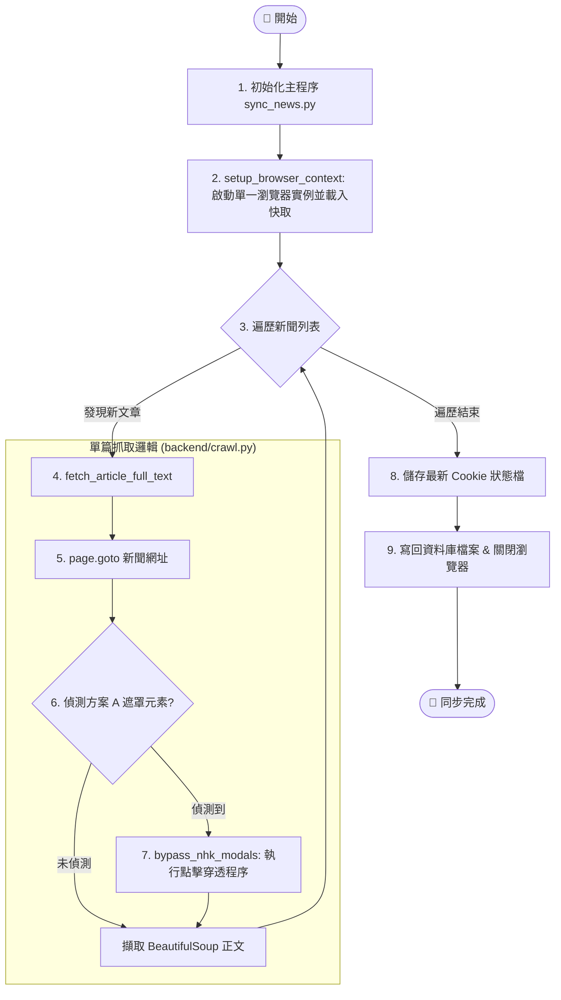

# NHK 新聞同步工作流 (NHK News Sync Workflow)

本工作流說明了優化後的「共用 Context」爬蟲如何執行增量同步以及自動處理確認遮罩。

## 系統架構流程圖 (System Flowchart)



## 執行步驟 (Execution Steps)

1. **環境檢查**：
   確保 `data/` 目錄存在，且本地或 GitHub Cache 中已有 `playwright_state.json` (如有)。

// turbo
2. **執行同步**：
   ```bash
   python sync_news.py
   ```

3. **觀察輸出**：
   - 如果看到 `⚠️ 偵測到遮罩層`：代表 Cookie 過期或 NHK 強制要求驗證，程式會自動處理。
   - 如果直接看到 `🔍 爬取新新聞`：代表 Cookie 生效，已實現極速跳轉。

4. **結果檢查**：
   確認 `data/news_db.json` 或 `data/news_db_test.json` 已更新最新內容。
