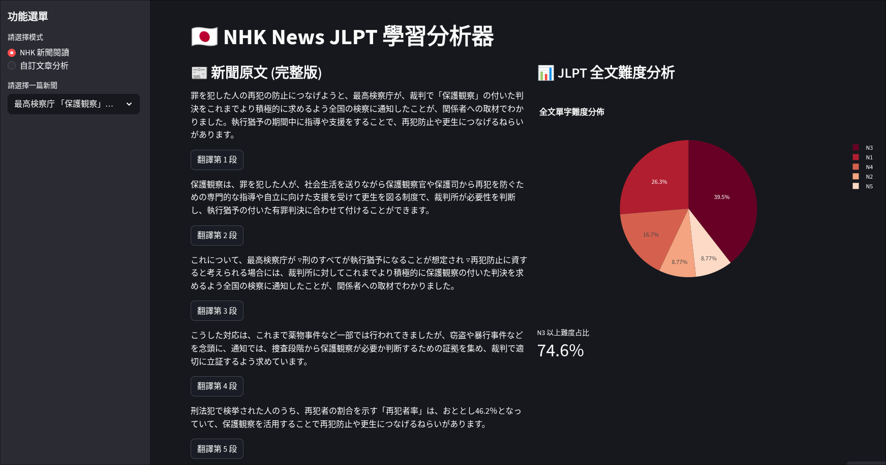

# 🇯🇵 NHK News JLPT Analyzer

[](https://www.python.org/)
[](https://streamlit.io)
[](https://github.com/alvin999/NHKNewsJLPTAnalyzer/actions/workflows/update_news.yml)

這是一個基於 Python 與 Streamlit 開發的日語學習輔助工具。它能夠自動爬取 NHK News Web 的最新新聞，並提供即時的中文翻譯以及 JLPT（日本語能力試驗）單字難度分析，幫助學習者更有效率地閱讀日文新聞。

🔗 **線上展示 (Live Demo)**: [](https://nhknewsjlptanalyzer-alvin999.streamlit.app/)



## ✨ 主要功能

1.  **NHK 新聞爬蟲**：
    - 自動抓取 NHK News Web 最新新聞列表。
    - 使用 Playwright 突破海外存取限制，獲取完整內文。
2.  **JLPT 難度分析**：
    - 使用 **SudachiPy** 進行精準的日語斷詞。
    - 比對 JLPT 單字庫，分析文章中 N1 ~ N5 各級單字的分佈比例。
    - 透過 Plotly 圓餅圖視覺化呈現文章難度結構。
3.  **即時翻譯**：
    - 支援段落式翻譯（整合 Google Translate）。
    - 點擊按鈕即可查看特定段落的中文翻譯，方便對照學習。
4.  **自訂文章分析**：
    - 支援使用者自行貼上日文文章。
    - 提供全文翻譯與 JLPT 難度分析功能。
5.  **互動式介面**：
    - 使用 Streamlit 建構，操作簡單直觀。

## 🛠️ 技術棧

- **前端/介面**: [Streamlit](https://streamlit.io/)
- **爬蟲**: [Playwright](https://playwright.dev/python/), [BeautifulSoup4](https://www.crummy.com/software/BeautifulSoup/)
- **自然語言處理 (NLP)**: [SudachiPy](https://github.com/WorksApplications/SudachiPy) (斷詞), SudachiDict-full
- **資料處理與視覺化**: Pandas, Plotly
- **翻譯**: googletrans

## 📂 專案結構

```text
NHKNewsJLPTAnalyzer/
├── .github/
│   └── workflows/update_news.yml # GitHub Actions 自動排程
├── app.py                  # Streamlit 主程式入口
├── sync_news.py            # 新聞同步腳本
├── app/
│   ├── analyzer.py         # JLPT 單字分析邏輯 (SudachiPy)
│   └── translator.py       # 翻譯模組
├── backend/
│   └── crawl.py            # NHK 新聞爬蟲 (Playwright)
├── data/
│   └── news_db.json        # 新聞資料庫 (JSON 格式)
└── README.md
```

## 🚀 快速開始

### 1. 環境設定與安裝

本專案建議使用 **Python 3.9 ~ 3.12** (Python 3.13 以上版本暫不支援)。

```bash
pip install -r requirements.txt
```
### 2. 啟動應用程式

```bash
streamlit run app.py
```

## ⚠️ 注意事項

- **資料來源**：新聞內容來自 [NHK News Web](https://www3.nhk.or.jp/news/)。
- **JLPT 資料來源**：單字分級資料引用自 [JLPT_Vocabulary](https://raw.githubusercontent.com/Bluskyo/JLPT_Vocabulary/main/data/results/JLPTWords.csv)。
- **免責聲明**：本系統僅供個人日語學習與研究使用，請勿用於商業用途。